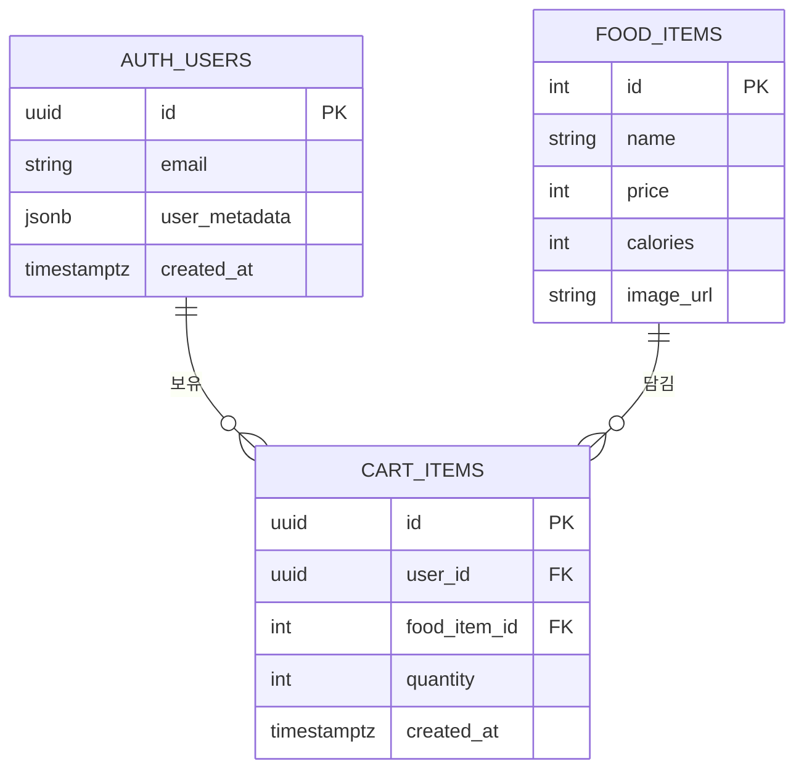
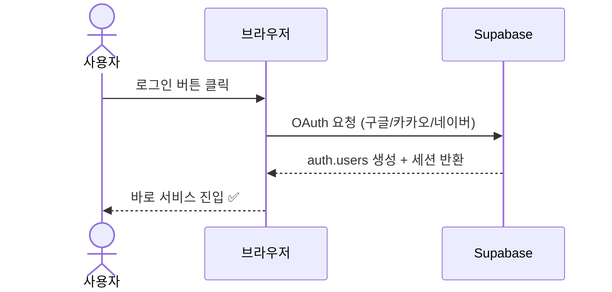
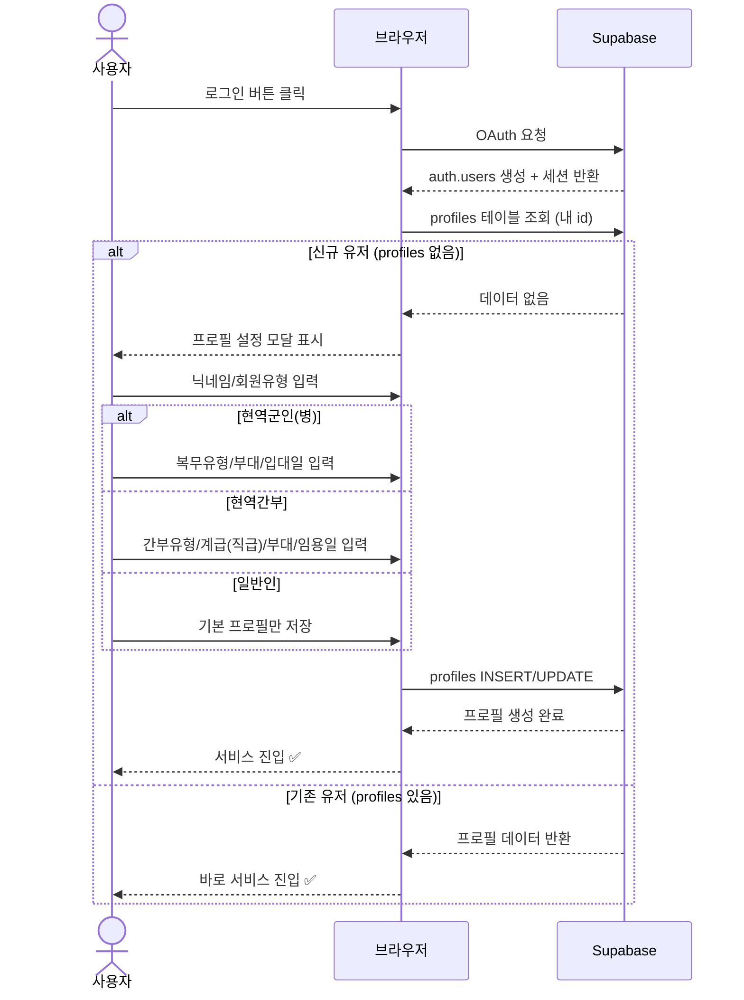

# Modern Sentinel — DB 스키마 변경 가이드

> 작성일: 2026-03-25
> 브랜치: `komong/issue19`
> 담당: 커뮤니티 기능 구현

---

## 1. 변경 전 — 기존 DB 상태

기존 프로젝트는 **Supabase가 자동으로 관리하는 `auth.users`** 와 쇼핑 관련 테이블만 존재했습니다.

| 테이블 | 위치 | 설명 | 직접 생성 여부 |
|--------|------|------|---------------|
| `auth.users` | Supabase 내부 | OAuth 로그인 사용자 정보 (자동 생성) | ❌ Supabase 자동 |
| `food_items` | public | PX 쇼핑몰 상품 목록 | ✅ 기존 생성 |
| `cart_items` | public | 장바구니 항목 | ✅ 기존 생성 |

### 기존 문제점

```
OAuth 로그인 (구글/카카오/네이버)
        ↓
auth.users에만 저장됨 (Supabase 내부 테이블)
        ↓
❌ 닉네임, 계급 등 서비스 정보 없음
❌ 커뮤니티 글/댓글의 작성자를 특정할 수 없음
❌ 회원별 기능(글쓰기, 댓글) 구현 불가
```

### 기존 ERD



---

## 2. 변경 후 — 추가된 테이블

**`backend/sql/community_schema.sql`** 을 Supabase에서 실행하면 아래 3개 테이블이 추가됩니다.

| 테이블 | 설명 | 주요 특징 |
|--------|------|-----------|
| `profiles` | 서비스 내 사용자 프로필 | `auth.users`와 1:1, 닉네임 필수 |
| `community_posts` | 커뮤니티 게시글 | 카테고리 3종, 조회수 자동 증가 |
| `community_comments` | 게시글 댓글 | 단일 레벨 (대댓글 없음) |

---

## 3. 변경 후 전체 ERD

```mermaid
erDiagram
    AUTH_USERS {
        uuid id PK
        string email
        jsonb user_metadata
        timestamptz created_at
    }

    PROFILES {
        uuid id PK_FK "auth.users.id 참조"
        string nickname "unique, 필수"
        string user_type "회원 유형 (civilian/active_enlisted/active_cadre)"
        string cadre_category "현역간부 직군"
        string rank "계급 (선택)"
        string unit "소속부대 (선택)"
        date enlistment_date "입대일 (선택)"
        string service_track "현역 군인 복무 유형"
        boolean profile_completed "프로필 설정 완료 여부"
        string avatar_url "Supabase Storage 프로필 이미지 경로"
        timestamptz created_at
        timestamptz updated_at
    }

    COMMUNITY_POSTS {
        uuid id PK
        uuid author_id FK "profiles.id 참조"
        string title "필수"
        string content "필수"
        string category "general/question/info"
        int views "기본값 0"
        timestamptz created_at
        timestamptz updated_at
    }

    COMMUNITY_COMMENTS {
        uuid id PK
        uuid post_id FK "community_posts.id 참조"
        uuid author_id FK "profiles.id 참조"
        string content "필수"
        timestamptz created_at
    }

    FOOD_ITEMS {
        int id PK
        string name
        int price
        int calories
        string image_url
    }

    CART_ITEMS {
        uuid id PK
        uuid user_id FK
        int food_item_id FK
        int quantity
        timestamptz created_at
    }

    AUTH_USERS ||--|| PROFILES : "1:1 (OAuth → 서비스 프로필)"
    AUTH_USERS ||--o{ CART_ITEMS : "보유"
    FOOD_ITEMS ||--o{ CART_ITEMS : "담김"
    PROFILES ||--o{ COMMUNITY_POSTS : "작성"
    PROFILES ||--o{ COMMUNITY_COMMENTS : "작성"
    COMMUNITY_POSTS ||--o{ COMMUNITY_COMMENTS : "포함"
```

---

## 4. 새 테이블 상세 설명

### 4-1. `profiles` — 서비스 회원 프로필

```sql
create table public.profiles (
  id         uuid primary key references auth.users(id) on delete cascade,
  nickname   text not null unique,   -- 서비스 내 닉네임 (필수, 중복 불가)
  user_type  text,                   -- 회원 유형 (civilian/active_enlisted/active_cadre)
  cadre_category text,              -- 현역간부 직군
  rank       text,                   -- 계급 (선택)
  unit       text,                   -- 소속부대 (선택)
  enlistment_date date,             -- 입대일 (선택)
  service_track text,               -- 현역군인(병) 복무 유형
  profile_completed boolean not null default false, -- 프로필 설정 완료 여부
  avatar_url text,                   -- Supabase Storage 프로필 이미지 경로
  created_at timestamptz default now(),
  updated_at timestamptz default now()
);
```

**RLS 정책:**
| 작업 | 허용 대상 |
|------|-----------|
| SELECT | 누구나 (비로그인 포함) |
| INSERT | 본인(`auth.uid() = id`) |
| UPDATE | 본인(`auth.uid() = id`) |

---

### 4-2. `community_posts` — 커뮤니티 게시글

```sql
create table public.community_posts (
  id         uuid primary key default gen_random_uuid(),
  author_id  uuid not null references public.profiles(id) on delete cascade,
  title      text not null,
  content    text not null,
  category   text not null default 'general'
               check (category in ('general', 'question', 'info')),
  views      integer not null default 0,
  created_at timestamptz default now(),
  updated_at timestamptz default now()   -- 수정 시 트리거로 자동 갱신
);
```

**카테고리 값:**
| 값 | 화면 표시 |
|----|-----------|
| `general` | 자유게시판 |
| `question` | 질문게시판 |
| `info` | 정보공유 |

**RLS 정책:**
| 작업 | 허용 대상 |
|------|-----------|
| SELECT | 누구나 |
| INSERT | 로그인 사용자 (본인 author_id) |
| UPDATE | 본인 글만 |
| DELETE | 본인 글만 |

---

### 4-3. `community_comments` — 댓글

```sql
create table public.community_comments (
  id         uuid primary key default gen_random_uuid(),
  post_id    uuid not null references public.community_posts(id) on delete cascade,
  author_id  uuid not null references public.profiles(id) on delete cascade,
  content    text not null,
  created_at timestamptz default now()
);
```

**RLS 정책:**
| 작업 | 허용 대상 |
|------|-----------|
| SELECT | 누구나 |
| INSERT | 로그인 사용자 (본인 author_id) |
| DELETE | 본인 댓글만 |

---

## 5. 추가된 DB 함수

### `increment_post_views(p_post_id uuid)`
게시글 조회 시 views 컬럼을 1 증가시키는 함수.
`security definer`로 선언되어 RLS를 우회합니다 (비로그인도 조회수 증가 가능).

```sql
create or replace function public.increment_post_views(p_post_id uuid)
returns void language sql security definer as $$
  update public.community_posts set views = views + 1 where id = p_post_id;
$$;
```

### `set_updated_at()` 트리거
`profiles`와 `community_posts`에 UPDATE 발생 시 `updated_at`을 자동으로 현재 시간으로 갱신합니다.

---

## 6. 로그인 흐름 변경

### 변경 전


### 변경 후


---

## 7. Supabase 설정 방법

### Step 1. SQL 실행
신규 프로젝트:
Supabase 대시보드 → **SQL Editor** → `backend/sql/community_schema.sql` 내용 전체 복붙 → **Run**

기존 프로젝트(이미 `profiles` 테이블이 있는 경우):
Supabase 대시보드 → **SQL Editor** → `backend/sql/profile_enlistment_date_patch.sql` 실행 → **Run**

### Step 2. 환경변수 추가

`backend/.env` 파일에 추가:
```env
SUPABASE_URL=https://xxxxxxxxxxxx.supabase.co
SUPABASE_ANON_KEY=eyJhbGciOiJIUzI1NiIsInR5cCI6...
```

> `SUPABASE_URL`과 `SUPABASE_ANON_KEY`는 Supabase 대시보드 → **Project Settings → API** 에서 확인 가능

프로필 이미지 정책:
- `profiles.avatar_url`는 외부 OAuth URL이 아니라 Supabase Storage 경로로 사용
- Storage 버킷: `profile-images`
- 파일명 규칙: `0.png~18.png`
- 계급이 없으면 `default.png`

### Step 3. 확인 쿼리
```sql
-- 테이블 생성 확인
select table_name from information_schema.tables
where table_schema = 'public'
  and table_name in ('profiles', 'community_posts', 'community_comments');

-- RLS 활성화 확인
select tablename, rowsecurity from pg_tables
where schemaname = 'public'
  and tablename in ('profiles', 'community_posts', 'community_comments');
```

---

## 8. 파일 위치 정리

```
TeamC/
├── backend/
│   ├── sql/
│   │   └── community_schema.sql        ← ⭐ Supabase에서 실행할 SQL
│   └── app/
│       ├── api/v1/community.py         ← FastAPI 라우터
│       ├── schemas/community_schema.py ← Pydantic 스키마
│       └── services/community_service.py ← Supabase REST API 호출
└── frontend/
    └── src/
        ├── components/common/
        │   └── ProfileSetupModal.tsx   ← 신규 유저 프로필 설정 모달
        └── features/community/
            ├── CommunityPage.tsx       ← 게시글 목록
            ├── PostDetailPage.tsx      ← 게시글 상세 + 댓글
            ├── PostWritePage.tsx       ← 게시글 작성/수정
            ├── types.ts                ← 공통 타입 정의
            └── components/
                ├── PostCard.tsx        ← 목록 카드 컴포넌트
                └── CommentSection.tsx  ← 댓글 컴포넌트
```
